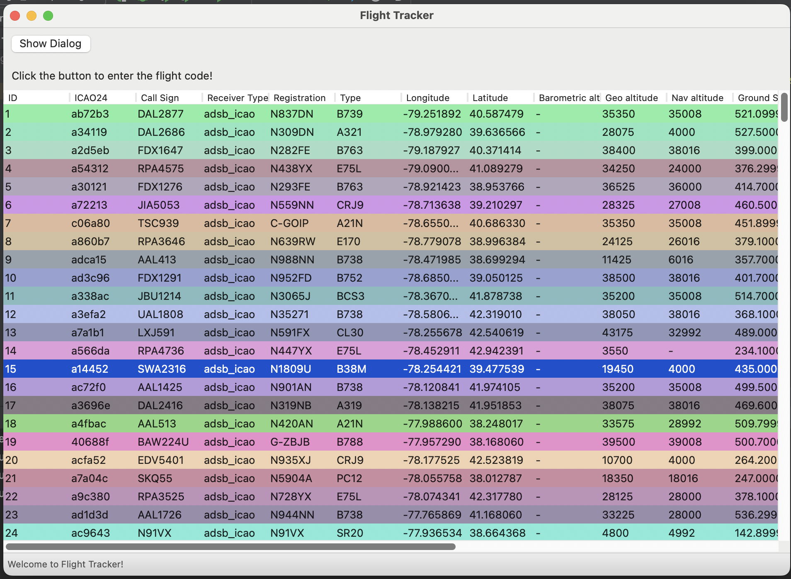
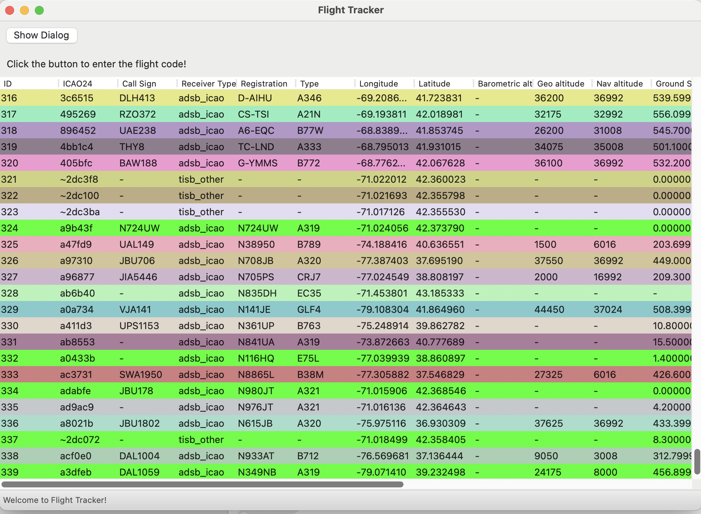
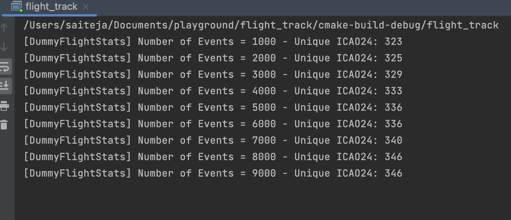

# Flight-Tracking

Team: Dylan Rose, Gargi Patil, Sai Teja Reddy Moolamalla

Library Documentation: https://saiteja-reddy.github.io/Flight-Tracking/

[Demo Link](https://drive.google.com/file/d/18v-480bffOkiI2yinfUK0cQXCwYoQPPn/view?usp=sharing)

## Overview
For our project, our goal is to make and use a well-designed C++ wrapper around an existing API to fetch flight-tracking data. We will be designing a wrapper to expose the REST API to C++ programs with an intuitive interface, and then build a display/UI to demo the functionality and potential use cases for our wrapper. We will include a set of tests for the wrapper, documentation, and measurements regarding the effect the wrapper has on request performance. 

Below are the expected components of our code: 
### Producer component
- Fetches, stores, and publishes flight data from REST API
- The data source is OpenSky REST API: https://openskynetwork.github.io/opensky-api
- Wraps REST API with C++ native classes and functionality
- Periodically polls for changes and publishes the data collected to an event/message queue.

### Consumer component 
- Subscribes to the event queue to which the Producer publishes.
- Below are the two dedicated consumer functionalities we’d be implementing as part of this project:
- Writing the latest data to a database (potentially, SQLite)
- Updating display/UI with new flight information

### UI/Display component
- Flight status dashboard
  - Take input of flight numbers, tracker IDs, or tail numbers.
  - Refreshes continuously based on new events/changes from API
  - The initial state of the dashboard is fetched from the database, then it subscribes to the event queue as events are published from the Producer

## Tutorial

This application provides a C++ wrapper around the ADSB flight-tracking API to fetch information of flights around Columbia University quickly. You will be able to interact with the application through an intuitive colorful display interface.  The application pulls live flight information that is published from each aircraft's internal sensors across the ADS-B network, specifically using the open-source adsb.lol project.  Further information regarding the API can be found at:  https://api.adsb.lol/docs.

## Setup

The setup requires support for the following:
1. Cmake
2. C++ compiler supporting C++ 20

Packages/Libraries required:
1. Openssl: development
2. Cpprestsdk: development
3. wxWidgets: development
4. doxygen

For Mac: 
```
brew install openssl cpprestsdk wxWidgets doxygen
```

For Linux: 
```
sudo apt-get install libssl-dev libcpprest-dev libwxgtk3.2-dev doxygen
```

Installation:
```
git clone https://github.com/Saiteja-Reddy/Flight-Tracking.git –recurse-submodule
```

### Run

After installation, the following commands need to be run:

```
mkdir build
cd build
cmake --build .
./flight_track
```

This populates flights within 250 nautical miles radius of Columbia University. The below interface appears upon running. It details the information of flight which can be identified by its unique ID and call sign.



The application updates the flight information every 5 seconds as seen below.




- As the application updates, new events are added in bright green towards the bottom.
- If an existing flight is updated, the color will change from green to another color.

Every refresh, updates and/or adds up to 1000 flight events:



It also populates the SQLite database on the backend with the records in the flights table:


## Release Plan/Deliverables

### Release 0.8
- Producer - C++ interface to the REST API, publish events to an event queue.
- Consumer - generic consumer component with a custom implementation for database updates.
- Tutorial, documentation, tests.

### Release 1.0
- Enhanced UI/Display component with an intuitive design.
- Consumer - custom implementation of consumer for UI/display updates.
- Basic display component showing real-time events.

### Release 1.2
- Supporting a map view of the flights with m_latitude/m_longitude information of the flights.
- Functionality to add an always-running VM to log flight history internally for specific flights for potential users.

### Testing
- Unit tests - for the C++ client, publishing events, database updates, and display updates.
- Integration test - Publishing few sample events on the queue and making sure it’s updated on the database and display (end-to-end).

### Measurables 
- Currently, no baseline in C++ exists for such an app. We plan to measure the time added due to the wrapper and downstream compute.
- We also plan to stress test the application with an influx of events. 
